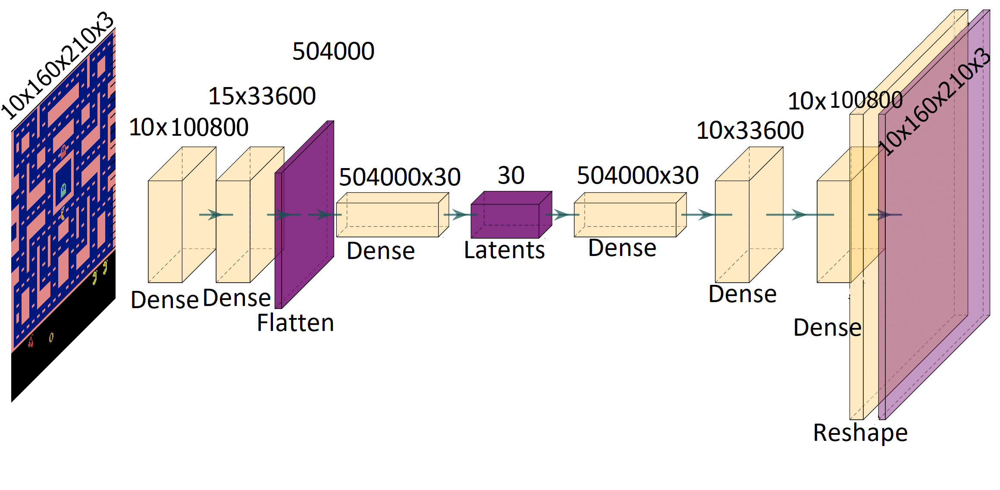
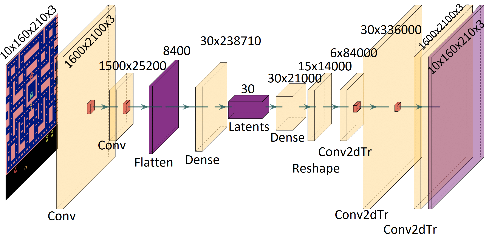
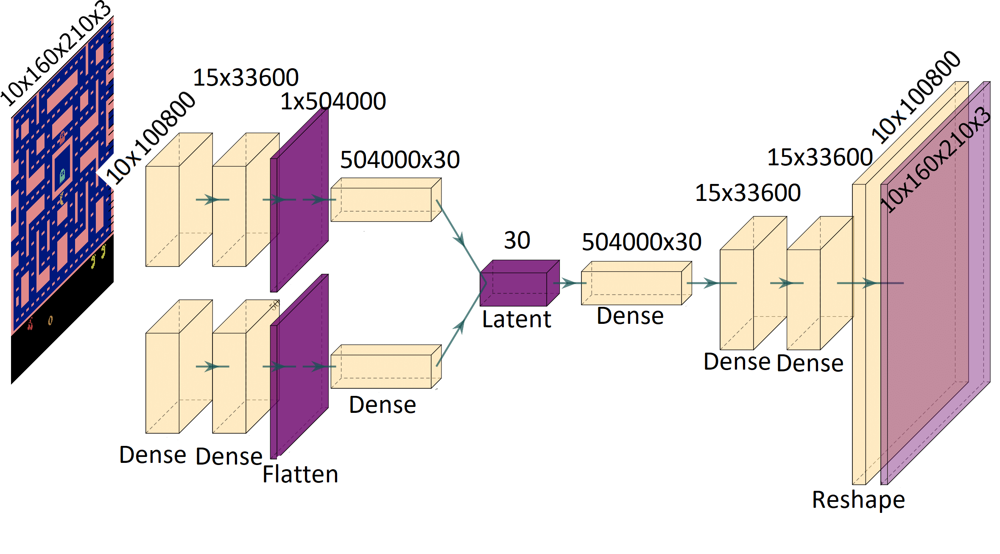
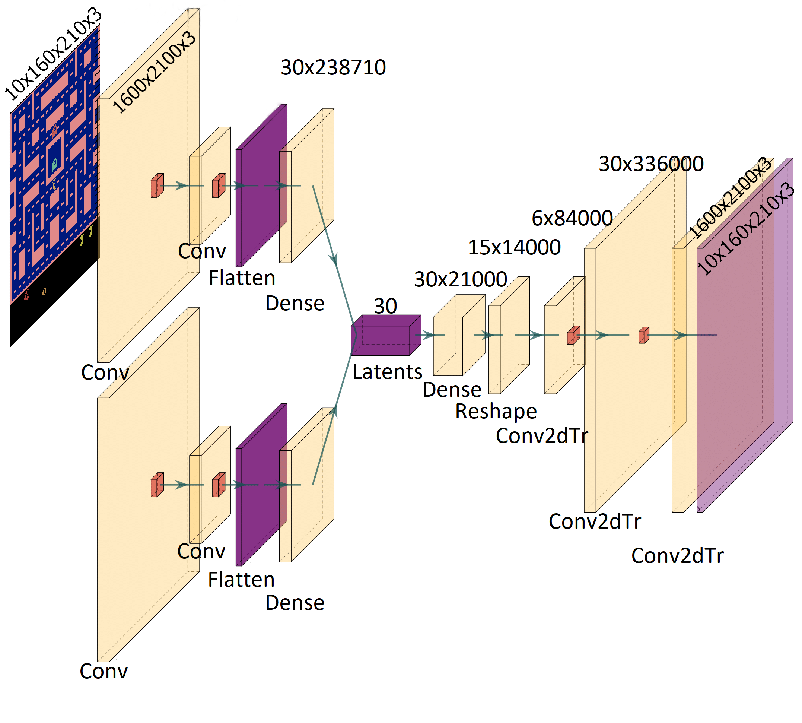

# Autoencoders-for-Video-Prediction
This repo is for "Autoencoders for Video Prediction" paper 

## Models
### Full Connected Autoencoder (FC-AE) 

### Convolutional Autoencoder (C-AE) 

### Full Connected Variational Autoencoder (FC-VAE) 

### Convolutional Variational Autoencoder (C-VAE) 

### Convolutional Time-Distributed/LSTM Autoencoder (C-TD-AE/C-LSTM-AE) 

### Convolutional Time-Distributed/LSTM Variational Autoencoder (C-TD-VAE/C-LSTM-VAE) 

## Datasets
Atari Datasets [3] originally intended for RNN(Recurrent Neural Network)usage, consists of recorded game play of 5 old Atari console games. This Thesis uses all 5 of them on different models as well as on 2 reference works as baselinefor the models. Below are some details and samples from all 5 games.
* Ms. Pacman : 1172401 training images 381757 validation images (a)
* Video Pinball : 901479 training images 295328 validation images (b)
* Q*bert : 1124726 training images 360062 validation images (c)
* Montezuma’s Revenge : 1783796 training images578075 validation images (d)
* Space Invaders : 1331762 training images 434316 validation images (e)
